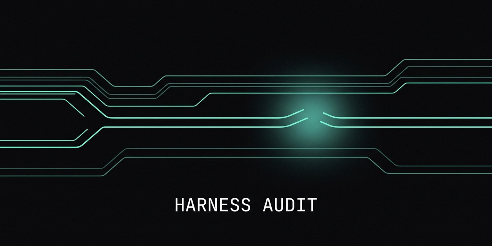

<p align="center">
  
</p>

# claude-harness-audit

**Audit your Claude Code harness with the Workflows feature — find dead hooks, bloated context, stale config, and rituals you should turn into scripts. Every finding is adversarially verified and shipped with a benchmark so you can prove the fix worked. Then run `/harness-optimize` to actually apply the fixes — backup-first, verified, nothing ever deleted.**

If you've grown a real Claude Code setup — custom hooks, dozens of agents, hundreds of skills, slash commands, session history — it rots. Hooks point at files you renamed. Your `CLAUDE.md` claims a guardrail is active when the script behind it is disabled. `references/` quietly grows to gigabytes and poisons every `grep`. You run the same multi-agent ritual (gap analysis, gate pipelines, councils) by hand every session, burning tokens babysitting subagents.

This skill turns the **Claude Code Workflows feature** (write scripts that call subagents) on your own harness:

1. **Inventory** — parallel auditors over your hooks/settings, instruction surface, agents, skills/commands, and session history.
2. **Synthesize** — merge into ranked **delete / update / enhance / new** recommendations.
3. **Verify** — one adversarial refuter per recommendation re-checks the evidence on disk. Catches the ~30% of first-pass findings that are wrong (already-fixed, mis-scoped, phantom paths).
4. **Benchmark** — a runnable suite (context-budget, hook health/latency, dead-reference count) so every "I fixed it" is provable, not self-attested.

## Requirements

- Claude Code **v2.1.154+** with Dynamic Workflows enabled (`/config` → Dynamic workflows → on).
- That's it. No API keys, no external services. Everything runs locally over your own `~/.claude/`.

## Install

```bash
git clone https://github.com/Dallionking/claude-harness-audit
cd claude-harness-audit
./install.sh          # symlinks the skill + workflows into ~/.claude/
```

Or copy manually:
```bash
cp -r skills/harness-audit skills/harness-optimize ~/.claude/skills/
cp workflows/*.workflow.js ~/.claude/workflows/
```

## Use

In Claude Code:
```
/harness-audit
```
or just ask: *"audit my Claude Code harness."* The skill runs the workflow, writes artifacts to `~/.claude/harness-audit-<date>/`, and reports what to delete, update, enhance, plus a benchmark suite.

To go from findings to applied fixes in one run:
```
/harness-optimize
```
or ask: *"optimize my harness."* It discovers what you actually have (a bare `~/.claude/` is enough; Codex, RTK, big session histories are detected and included only if present), scans for the expensive stuff — dead hook references, hooks firing on every prompt/tool-call, duplicate prompt-injectors, unbounded state files, plaintext secrets, instruction-surface bloat, session-history friction — asks you the few decisions that are genuinely yours (cleanup aggressiveness, scope), then applies the fixes. Every touched file is backed up first to `~/.claude/backups/harness-optimize-<date>/`, every config edit is re-validated, every fix is verified with real output, and it ends with a PASS/MISS/SKIP table. It never deletes anything — retire-to-backup only — and it will refuse to loosen your permission rules to "reduce friction."

Run a single bounded gap-analysis loop on anything:
```
/gap-loop   (then describe the target)
```

## What you get

```
~/.claude/harness-audit-<date>/
  RECOMMENDATIONS.md      # ranked delete/update/enhance/new, with evidence + effort
  VERIFICATION.md         # confirmed / needs-scoping / rejected verdicts
  BENCHMARKS.md           # runnable before/after suite + honest gap analysis
  findings/               # per-domain raw reports
  bench/baseline/         # your "before" snapshot — commit this
```

## Why adversarial verification matters

The audit's first pass is a hypothesis. The verify phase re-reads the cited file *right now* and tries to refute each claim. In testing on a large real harness, this caught recommendations that would have caused wrong fixes — editing paths that don't exist, using a CLI flag that isn't real, deleting a still-live component. **Never apply an unverified harness recommendation.**

## Workflow runtime notes (gotchas we hit, so you don't)

Authoring dynamic workflows surfaced three constraints worth knowing:

1. **No `process` / Node APIs in the sandbox.** The workflow body can't read `process.env.HOME`/`PWD`. Use `~`-relative paths (the agents' shell expands them) or pass absolute paths via `args`.
2. **`args` can arrive stringified.** Guard it: `let A = args; if (typeof A === 'string') { try { A = JSON.parse(A) } catch { A = {} } }`. Otherwise a passed object silently becomes empty and your defaults take over.
3. **`name:` resolution can serve a stale cached copy.** After editing a saved workflow, invoke it with `Workflow({ scriptPath: "…/your.workflow.js" })` (and call sub-workflows via `workflow({ scriptPath })`) to force the fresh file. `Workflow({ name })` may run a previously cached version.

Also: top-level `return`/`await` in a workflow body are valid (the runtime wraps it in an async function) — `node --check` will flag them as a false positive; ignore those two specific errors.

## License

MIT — see [LICENSE](LICENSE). Built with Claude Code.
